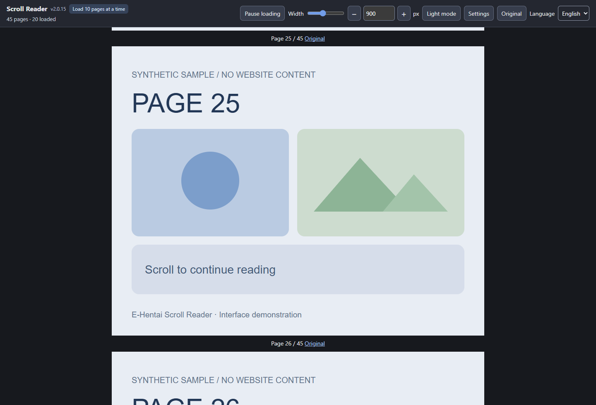
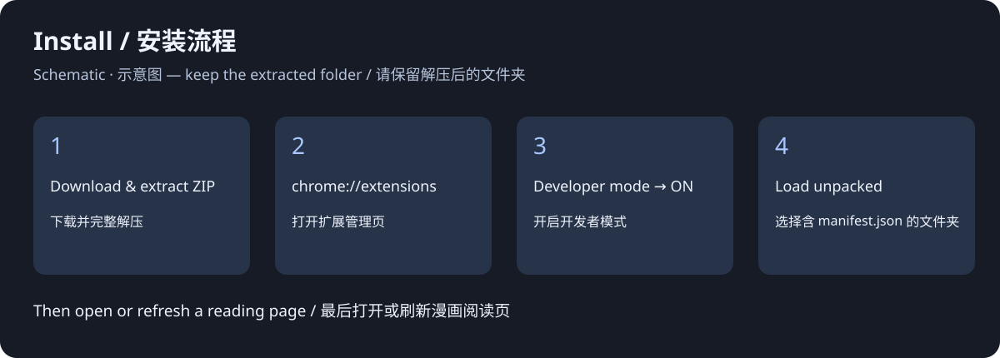
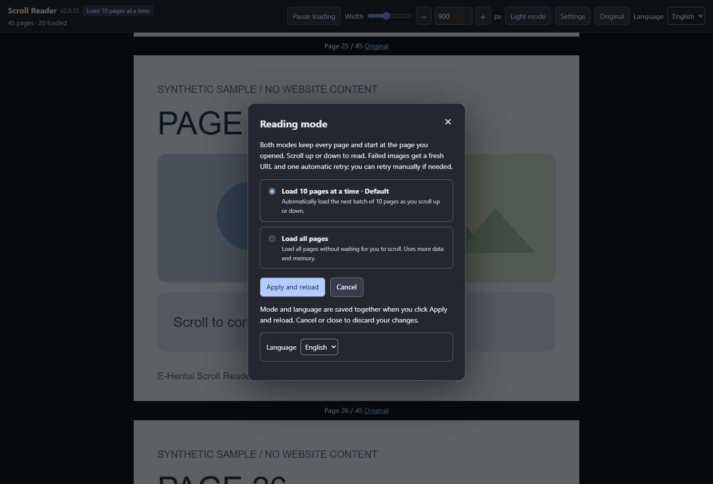

# E-Hentai Scroll Reader

[简体中文](README.zh-CN.md) · Version 2.0.15 · [MIT License](LICENSE)

An unofficial Chrome extension that turns E-Hentai's single-image reader into a continuous scrolling reader. Open a page and start there, with earlier and later pages still available above and below.

The screenshots use generated sample pages, not website or manga content.

## Loading modes

| Mode | Behavior |
| --- | --- |
| **Load 10 pages at a time — default** | Loads nearby pages in batches of 10 as you scroll up or down. No next-batch button. |
| **Load all pages** | Starts loading the entire book without waiting for scrolling. Many images may load at once. |

All page positions are created upfront. An empty page position does not mean the image has finished downloading. The loaded counter counts successful images. Batch boundaries near the start or end may contain fewer than 10 pages; nearby batches can overlap in time.

## Toolbar update

The toolbar groups controls into aligned rows in split-screen windows. Use the width **− / +** buttons to adjust by 10 px; changes are saved automatically.

## Features

- English and Chinese interface; English on first use.
- Start at the page you opened, and read in either direction.
- Adjust image width (400–1600 px) and light/dark background.
- Keep each image's proportions without cropping or stretching.
- Refresh a failed image URL and retry automatically once; manual retry remains available.
- Pause new loading work and return to the original page.
- Apply mode/language settings together and restore your current reading page and position after that reload.

## Install

1. In this repository's **Releases** section, download the attached `ehentai-scroll-reader-v2.0.15.zip` file. Alternatively, use **Code → Download ZIP** for the source.
2. Extract the ZIP to a folder you will keep. Do not select or drag the ZIP itself into Chrome.
3. Open `chrome://extensions` and turn on **Developer mode**.
4. Click **Load unpacked** and choose the extracted folder containing `manifest.json` directly inside it.
5. Open or refresh an E-Hentai single-image reading page.

Installation diagram is a schematic, not a Chrome screenshot. See [Chrome's official installation instructions](https://developer.chrome.com/docs/extensions/get-started/tutorial/hello-world#load-unpacked).

This is a manually installed extension distributed through GitHub, not a Chrome Web Store listing. Keep only one version of this reader enabled. If an organization disables developer mode, this installation method may be unavailable.

## Settings and updates

Use **Settings** in the reader or click the extension icon. Choose the mode and language, then **Apply and reload**. Cancel, close, or Escape discards the dialog's unapplied choices. The toolbar language control takes effect immediately.

To update, replace the files in the same installed folder with a new release, click the extension's reload button on `chrome://extensions`, and refresh the reading tab. GitHub ZIP installations do not update automatically. An old saved page-by-page mode falls back to the default 10-page mode.

## Scope and limitations

- Supported URL: `https://e-hentai.org/s/*`. Gallery listings, ExHentai, and other sites are not supported by this build.
- Access to the original page is still required; the extension does not bypass login, verification, or access restrictions.
- All-pages mode retains the v2.0.9 loading behavior: it does **not** include the experimental six-image limit or scroll-position optimizations.
- Loaded images remain in the page. Even 10-page mode can use more memory as you read; it does not unload distant images.
- Pausing stops new loading work; requests already underway can finish.
- Large galleries, network failures, and site changes can affect performance or recognition. This is not an offline downloader.
- Position restoration applies to the extension's **Apply and reload** action, not every ordinary browser refresh or a permanent reading-history feature.

See [troubleshooting and verification](docs/TESTING.md) and [privacy details](PRIVACY.md).

## Feedback

Use this repository's Issues section. Include your extension version, Chrome version, selected mode, and steps to reproduce. Remove private URLs, tokens, account details, and personal content from screenshots and logs.

## License

Copyright (c) 2026 KenLim0912. Distributed under the [MIT License](LICENSE). This license covers the extension and its included documentation/sample assets, not the website or third-party manga content. This is an independent project, not an official E-Hentai product.
