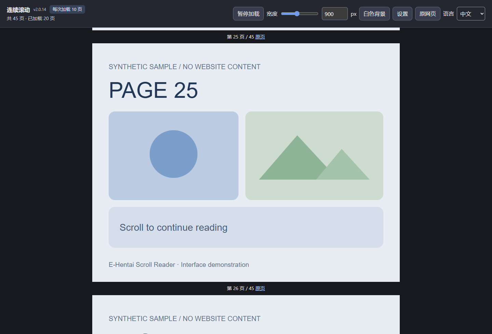
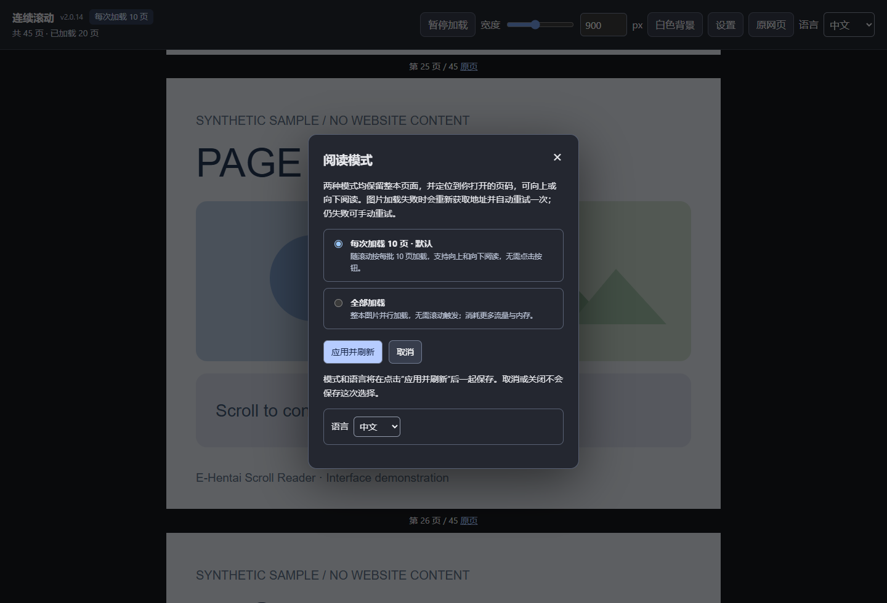

# E-Hentai 滚动阅读器

[English](README.md) · 版本 2.0.14 · [MIT 许可证](LICENSE)

将 E-Hentai 的单页漫画阅读界面变成连续滚动阅读。打开第几页，就从那一页开始；前后的页面仍然保留，可以向上或向下阅读。

截图采用生成的示例页面，不包含网站或漫画内容。

## 两种加载模式

| 模式 | 加载方式 |
| --- | --- |
| **每次加载 10 页 · 默认** | 随着向上或向下滚动，自动按每批 10 页加载附近图片，不需要按按钮。 |
| **全部加载** | 不用滚动就自动加载整本，多张图片可能同时下载。 |

两种模式都会先摆出整本的页面位置。页面空位不等于图片已下载；“已加载”只统计成功加载的图片。靠近开头或结尾时，一批可能不足 10 页；附近批次可能同时加载。

## 功能

- 中英文切换，首次使用默认英文。
- 从打开的页码开始阅读，前后页面均可滚动查看。
- 调整阅读宽度（400–1600 px）与黑白背景。
- 图片按自身比例显示，不拉伸、不裁切。
- 图片失败后重新获取地址，自动重试一次；仍失败可手动重试。
- 暂停新的加载任务，或返回原网页。
- 设置中的模式和语言点击应用后一起保存，并恢复刷新前的阅读页及页内位置。

## 安装

1. 在仓库的 **Releases** 页面下载附件 `ehentai-scroll-reader-v2.0.14.zip`；也可选择 **Code → Download ZIP** 下载源码。
2. 完整解压到一个固定文件夹，不要直接把 ZIP 拖进 Chrome。
3. 在 Chrome 地址栏打开 `chrome://extensions`，开启右上角的 **开发者模式 / Developer mode**。
4. 点击 **加载已解压的扩展程序 / Load unpacked**，选择直接包含 `manifest.json` 的文件夹。
5. 打开或刷新 E-Hentai 的单张图片阅读页。

上图是安装流程示意，并非 Chrome 实际截图。可参考 [Chrome 官方说明](https://developer.chrome.com/docs/extensions/get-started/tutorial/hello-world#load-unpacked)。

这是通过 GitHub 分发、手动安装的扩展，不是 Chrome 应用商店安装包。只开启一个版本，避免冲突。如果单位管理的浏览器禁用了开发者模式，可能无法用此方式安装。

## 设置与更新

点击阅读栏的“设置”或浏览器中的扩展图标，选好模式和语言后点击“应用并刷新”。设置窗口内点击取消、关闭或 Esc 都不保存这次选择。阅读工具栏上的语言切换仍然立即生效。

更新时，将新版文件解压覆盖到原来的安装文件夹，在扩展管理页点击该扩展的重新加载按钮，再刷新漫画页。GitHub ZIP 安装不会自动更新。旧版保存的“逐页加载”模式会自动改用默认的“每次加载 10 页”。

## 支持范围与限制

- 仅支持 `https://e-hentai.org/s/*` 阅读页，不支持目录页、ExHentai 或其他网站。
- 需要原网页本身可以访问，不绕过登录、验证或访问限制。
- 全部加载沿用 v2.0.9 的方式，未加入实验版的“同时 6 张限制”或“滚动位置检测优化”。
- 已加载图片会留在页面中，读得越多仍可能占用更多内存；目前不会自动释放远处图片。
- 暂停不会强行中断已经开始的请求。
- 页数很多、网络异常或网站改版可能造成卡顿、加载失败或无法启动。这不是离线下载工具。
- 阅读位置恢复针对插件的“应用并刷新”，不等于每次普通刷新都会恢复，也不是永久阅读记录。

更多信息见 [故障排查与测试说明](docs/TESTING.md) 和 [隐私说明](PRIVACY.md)。

## 问题反馈

请在仓库的 Issues 中提供扩展版本、Chrome 版本、所选模式和复现步骤。截图及日志请删除私人链接、令牌、账户信息和不适合公开的内容。

## 许可证

Copyright (c) 2026 KenLim0912。采用 [MIT 许可证](LICENSE)。授权范围是本插件及附带文档、示例素材，不包括网站或第三方漫画内容。本项目为非官方独立项目。
